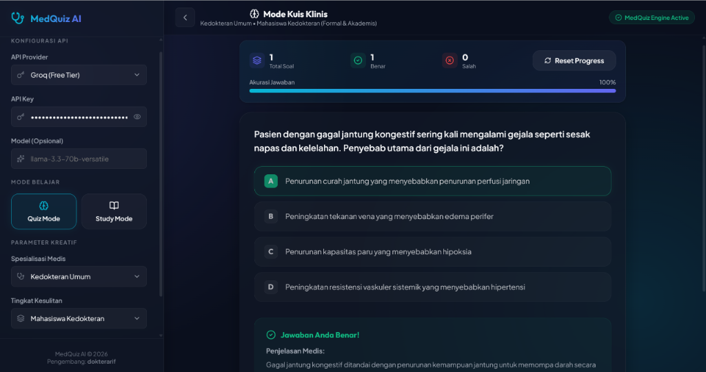

# MedQuiz AI - Kuis Medis & Asisten Belajar Interaktif 🩺



MedQuiz AI adalah aplikasi web interaktif berbasis **React + Vite** yang dirancang sebagai kuis medis klinis dan asisten belajar kedokteran bertenaga AI. Aplikasi ini dikembangkan untuk memenuhi tugas **Final Project** dalam kursus *LLM-Based Tools and Gemini API Integration for Data Scientists* di **Hacktiv8**.

Dengan antarmuka gelap premium bergaya *glassmorphism*, aplikasi ini mengintegrasikan Large Language Model (LLM) untuk menghasilkan studi kasus klinis yang dinamis, melacak akurasi jawaban, dan menyajikan penjelasan medis yang mendalam.

---

## 🚀 Fitur Utama

### 1. Multi-Provider API (Groq & OpenRouter)
Mendukung fleksibilitas penggunaan API dengan format OpenAI-compatible:
*   **Groq (Free Tier)**: Sangat cepat dan gratis menggunakan model default `llama-3.3-70b-versatile` atau `mixtral-8x7b-32768`.
*   **OpenRouter (Premium/Paid)**: Mendukung berbagai model canggih seperti `google/gemini-2.5-flash` atau `deepseek/deepseek-chat`.
*   **Keamanan**: API Key Anda disimpan dengan aman secara lokal di `localStorage` browser Anda, tidak dikirim ke server backend mana pun.

### 2. Parameter Kreatif AI
Personalisasikan pengalaman belajar Anda dengan parameter yang dapat disesuaikan langsung di panel pengaturan samping (sidebar):
*   **Spesialisasi Medis**: Kedokteran Umum, Kardiologi & Pembuluh Darah, Pediatri (Kesehatan Anak), Neurologi (Saraf), Anatomi & Fisiologi, serta Farmakologi & Terapi.
*   **Tingkat Kesulitan**: Masyarakat Umum, Mahasiswa Kedokteran, hingga Profesional / Dokter Spesialis.
*   **Gaya Bahasa (Tone)**: Formal & Akademis (cocok untuk ujian), Santai & Ramah, atau Mentor yang Tegas.

### 3. Dua Mode Pembelajaran
*   🧠 **Quiz Mode (Mode Kuis)**: AI akan men-generate soal kasus klinis pilihan ganda (A, B, C, D) secara real-time. Dilengkapi dengan papan skor interaktif (Total Soal, Benar, Salah, Persentase Akurasi) serta penjelasan medis yang terperinci setelah Anda memilih jawaban.
*   📖 **Study Mode (Mode Belajar)**: Konsultasi kuis bebas berbasis obrolan (chat). Tanyakan patofisiologi penyakit, mekanisme kerja obat (pharmacodynamics), maupun struktur anatomis tubuh manusia secara interaktif.

---

## 🛠️ Tech Stack

*   **Frontend**: React (v19), Vite (v8)
*   **Styling**: Vanilla CSS (menggunakan arsitektur CSS modern dengan variabel kustom HSL, Glassmorphic Panels, dan Micro-Animations)
*   **Icons**: Lucide React
*   **API Connection**: Fetch API standar (OpenAI-compatible endpoints)

---

## 📦 Panduan Instalasi & Penggunaan Lokal

Ikuti langkah-langkah di bawah ini untuk menjalankan MedQuiz AI di komputer lokal Anda:

### 1. Prasyarat
Pastikan Anda sudah menginstal:
*   [Node.js](https://nodejs.org/) (Versi rekomendasi: LTS / v18 atau lebih tinggi)
*   npm (biasanya otomatis terinstal bersama Node.js)

### 2. Clone dan Masuk ke Folder Proyek
Jika Anda menggunakan git:
```bash
git clone <url-repositori-github-anda>
cd medquiz
```
Atau navigasikan terminal ke folder proyek:
```bash
cd c:\aplikasi\medquiz
```

### 3. Instal Dependensi
Pasang pustaka-pustaka yang diperlukan dengan menjalankan perintah:
```bash
npm install
```

### 4. Jalankan Server Pengembangan
Jalankan dev-server lokal menggunakan Vite:
```bash
npm run dev
```
Setelah berhasil, buka tautan berikut di browser Anda:
👉 **[http://localhost:5173/](http://localhost:5173/)**

### 5. Konfigurasi Awal di Browser
1.  Buka panel pengaturan (sidebar kiri).
2.  Pilih **API Provider** yang ingin digunakan (Groq atau OpenRouter).
3.  Masukkan **API Key** Anda.
4.  Pilih spesialisasi, kesulitan, dan gaya bahasa yang diinginkan.
5.  Mulai kuis atau obrolan belajar!

---

## 🏗️ Build untuk Produksi

Untuk mengompilasi dan mengemas aplikasi menjadi bundel siap sebar ke server produksi (seperti GitHub Pages, Vercel, atau Netlify):
```bash
npm run build
```
Hasil kompilasi akan otomatis terbuat di folder `/dist` dalam bentuk static file HTML/CSS/JS yang ringan dan optimal.

---

## 📝 Pengembang

*   **Pengembang**: dokterarif
